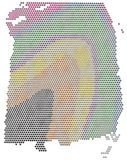

<!-- README.md is generated from README.Rmd. Please edit that file -->

```{r, include = FALSE}
knitr::opts_chunk$set(
  collapse = TRUE,
  comment = "#>",
  fig.path = "man/figures/README-",
  out.width = "100%"
)
```

# spatialLIBD 

<!-- badges: start -->
[](https://www.tidyverse.org/lifecycle/#maturing)
[](https://travis-ci.org/LieberInstitute/spatialLIBD)
[](https://bioconductor.org/checkResults/release/bioc-LATEST/spatialLIBD)
[](https://codecov.io/gh/LieberInstitute/spatialLIBD?token=GcSS9zWSp7)
<!-- badges: end -->

The `spatialLIBD` package contains functions for:

* Accessing the spatial transcriptomics data from the LIBD Human Pilot project ([code on GitHub](https://github.com/LieberInstitute/HumanPilot)) generated with the Visium platform from 10x Genomics. The data is retrieved from [Bioconductor](http://bioconductor.org/)'s `ExperimentHub`.
* Visualizing the spot-level spatial gene expression data and clusters.
* Inspecting the data interactively either on your computer or through [jhubiostatistics.shinyapps.io/spatialLIBD/](https://jhubiostatistics.shinyapps.io/spatialLIBD/).

For more details, please check the [documentation website](http://lieberinstitute.github.io/spatialLIBD) or the Bioconductor package landing page [here](https://bioconductor.org/packages/spatialLIBD).

## Installation instructions

Get the latest stable `R` release from [CRAN](http://cran.r-project.org/). Then install `spatialLIBD` using from [Bioconductor](http://bioconductor.org/) the following code:

```{r 'install', eval = FALSE}
if (!requireNamespace("BiocManager", quietly = TRUE))
    install.packages("BiocManager")

BiocManager::install("spatialLIBD")
```


## Access the data

Using `spatialLIBD` you can access the Human DLPFC spatial transcriptomics data from the 10x Genomics Visium platform. For example, this is the code you can use to access the layer-level data. For more details, check the help file for `fetch_data()`.

```{r 'access_data', message=FALSE, fig.path = "man/figures/", fig.height = 8, fig.width = 9}
## Load the package
library('spatialLIBD')

## Download the spot-level data
sce <- fetch_data(type = 'sce')

## This is a SingleCellExperiment object
sce

## Note the memory size
pryr::object_size(sce)

## Remake the logo image with histology information
sce_image_clus(
    sce = sce,
    clustervar = 'layer_guess_reordered',
    sampleid = '151673',
    colors = libd_layer_colors,
    ... = ' LIBD Layers'
)
```


## Citation

Below is the citation output from using `citation('spatialLIBD')` in R. Please 
run this yourself to check for any updates on how to cite __spatialLIBD__.

```{r 'citation', eval = requireNamespace('spatialLIBD')}
citation('spatialLIBD')
```


## Code of conduct


Please note that the `spatialLIBD` project is released with a
  [Contributor Code of Conduct](CODE_OF_CONDUCT.md).
  By contributing to this project, you agree to abide by its terms.

## Development tools

* Testing on Bioc-devel is possible thanks to [R Travis](http://docs.travis-ci.com/user/languages/r/).
* Code coverage assessment is possible thanks to [codecov](https://codecov.io/gh).
* The [documentation website](http://lieberinstitute.github.io/spatialLIBD) is automatically updated thanks to `r BiocStyle::CRANpkg('pkgdown')` and `r BiocStyle::Githubpkg('ropenscilabs/travis')`.

<a href="https://www.libd.org/"></a>
