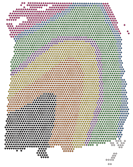
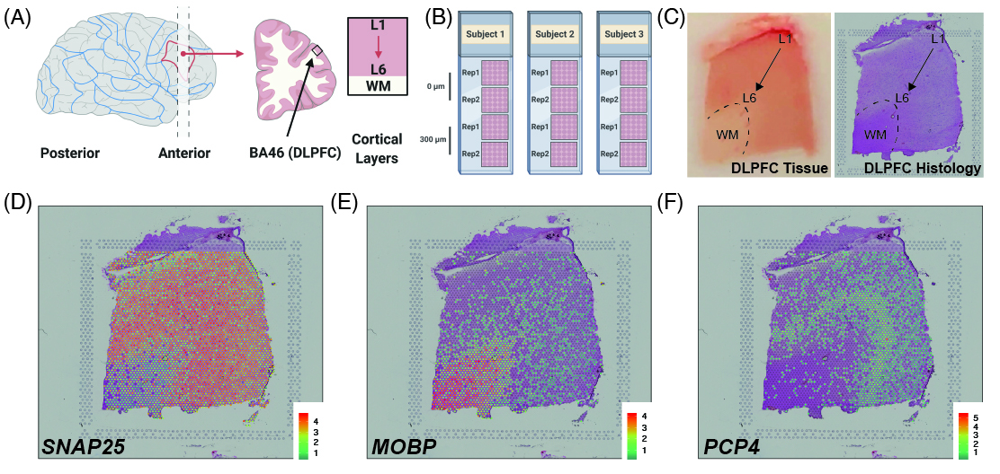
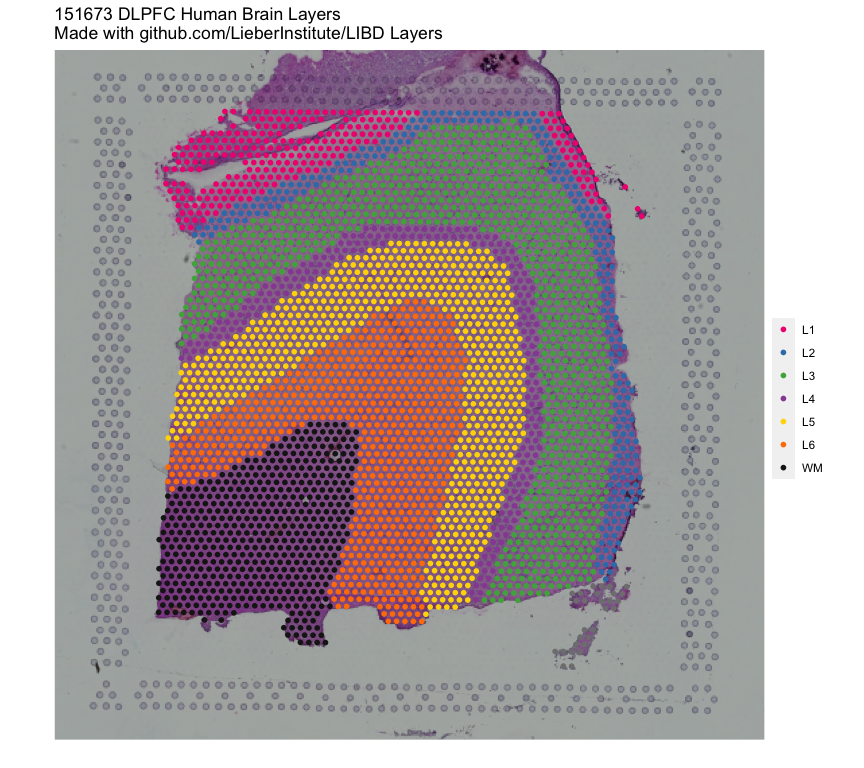

<!-- README.md is generated from README.Rmd. Please edit that file -->

# spatialLIBD 

<!-- badges: start -->

[](https://www.tidyverse.org/lifecycle/#stable)
[](http://bioconductor.org/checkResults/release/data-experiment-LATEST/spatialLIBD/)
[](http://bioconductor.org/checkResults/devel/data-experiment-LATEST/spatialLIBD/)
[](https://codecov.io/gh/LieberInstitute/spatialLIBD?branch=master)
[](https://github.com/LieberInstitute/spatialLIBD/actions)
[](https://support.bioconductor.org/t/spatialLIBD/)
[](https://github.com/LieberInstitute/spatialLIBD/issues)
[](https://zenodo.org/badge/latestdoi/225913568)
<!-- badges: end -->

Welcome to the `spatialLIBD` project! It is composed of:

-   a [shiny](https://shiny.rstudio.com/) web application that we are
    hosting at
    [spatial.libd.org/spatialLIBD/](http://spatial.libd.org/spatialLIBD/)
    that can handle a
    [limited](https://github.com/LieberInstitute/spatialLIBD/issues/2)
    set of concurrent users,
-   a Bioconductor package at
    [bioconductor.org/packages/spatialLIBD](http://bioconductor.org/packages/spatialLIBD)
    (or from [here](http://research.libd.org/spatialLIBD/)) that lets
    you analyze the data and run a local version of our web application
    (with our data or yours),
-   and a [research article](https://doi.org/10.1038/s41593-020-00787-0)
    with the scientific knowledge we drew from this dataset. The
    analysis code for our project is available
    [here](https://github.com/LieberInstitute/HumanPilot/) and the high
    quality figures for the manuscript are available through
    [Figshare](https://doi.org/10.6084/m9.figshare.13623902.v1).

The web application allows you to browse the LIBD human dorsolateral
pre-frontal cortex (DLPFC) spatial transcriptomics data generated with
the 10x Genomics Visium platform. Through the [R/Bioconductor
package](https://bioconductor.org/packages/spatialLIBD) you can also
download the data as well as visualize your own datasets using this web
application. Please check the
[manuscript](https://doi.org/10.1038/s41593-020-00787-0) or [bioRxiv
pre-print](https://www.biorxiv.org/content/10.1101/2020.02.28.969931v1)
for more details about this project.

If you tweet about this website, the data or the R package please use
the <code>\#spatialLIBD</code> hashtag. You can find previous tweets
that way as shown
<a href="https://twitter.com/search?q=%23spatialLIBD&src=typed_query">here</a>.
Thank you!
<a href="https://twitter.com/intent/tweet?button_hashtag=spatialLIBD&ref_src=twsrc%5Etfw" class="twitter-hashtag-button" data-show-count="false">Tweet
\#spatialLIBD</a>
<script async src="https://platform.twitter.com/widgets.js" charset="utf-8"></script>

## Study design

As a quick overview, the data presented here is from portion of the
DLPFC that spans six neuronal layers plus white matter (**A**) for a
total of three subjects with two pairs of spatially adjacent replicates
(**B**). Each dissection of DLPFC was designed to span all six layers
plus white matter (**C**). Using this web application you can explore
the expression of known genes such as *SNAP25* (**D**, a neuronal gene),
*MOBP* (**E**, an oligodendrocyte gene), and known layer markers from
mouse studies such as *PCP4* (**F**, a known layer 5 marker gene).



This web application was built such that we could annotate the spots to
layers as you can see under the **spot-level data** tab. Once we
annotated each spot to a layer, we compressed the information by a
pseudo-bulking approach into **layer-level data**. We then analyzed the
expression through a set of models whose results you can also explore
through this web application. Finally, you can upload your own gene sets
of interest as well as layer enrichment statistics and compare them with
our LIBD Human DLPFC Visium dataset.

If you are interested in running this web application locally, you can
do so thanks to the `spatialLIBD` R/Bioconductor package that powers
this web application as shown below.

``` r
## Run this web application locally
spatialLIBD::run_app()

## You will have more control about the length of the
## session and memory usage.

## You could also use this function to visualize your
## own data given some requirements described
## in detail in the package vignette documentation
## at http://research.libd.org/spatialLIBD/.
```

## Shiny website mirrors

-   [Main shiny application
    website](http://spatial.libd.org/spatialLIBD)
-   [Shinyapps](https://jhubiostatistics.shinyapps.io/spatialLIBD/)
-   [Shinyapps Mirror
    1](https://jhubiostatistics.shinyapps.io/spatialLIBD_mirror01/)
-   [Shinyapps Mirror
    2](https://jhubiostatistics.shinyapps.io/spatialLIBD_mirror02/)

## R/Bioconductor package

The `spatialLIBD` package contains functions for:

-   Accessing the spatial transcriptomics data from the LIBD Human Pilot
    project ([code on
    GitHub](https://github.com/LieberInstitute/HumanPilot)) generated
    with the Visium platform from 10x Genomics. The data is retrieved
    from [Bioconductor](http://bioconductor.org/)’s `ExperimentHub`.
-   Visualizing the spot-level spatial gene expression data and
    clusters.
-   Inspecting the data interactively either on your computer or through
    [spatial.libd.org/spatialLIBD/](http://spatial.libd.org/spatialLIBD/).

For more details, please check the [documentation
website](http://lieberinstitute.github.io/spatialLIBD) or the
Bioconductor package landing page
[here](https://bioconductor.org/packages/spatialLIBD).

## Installation instructions

Get the latest stable `R` release from
[CRAN](http://cran.r-project.org/). Then install `spatialLIBD` from
[Bioconductor](http://bioconductor.org/) using the following code:

``` r
if (!requireNamespace("BiocManager", quietly = TRUE)) {
    install.packages("BiocManager")
}

BiocManager::install("spatialLIBD")
```

If you want to use the development version of `spatialLIBD`, you will
need to use the R version corresponding to the current
Bioconductor-devel branch as described in more detail on the
[Bioconductor
website](http://bioconductor.org/developers/how-to/useDevel/). Then you
can install `spatialLIBD` from GitHub using the following command.

``` r
BiocManager::install("LieberInstitute/spatialLIBD")
```

## Access the data

Through the `spatialLIBD` package you can access the processed data in
it’s final R format. However, we also provide a table of links so you
can download the raw data we received from 10x Genomics.

### Processed data

Using `spatialLIBD` you can access the Human DLPFC spatial
transcriptomics data from the 10x Genomics Visium platform. For example,
this is the code you can use to access the layer-level data. For more
details, check the help file for `fetch_data()`.

``` r
## Load the package
library("spatialLIBD")

## Download the spot-level data
spe <- fetch_data(type = "spe")

## This is a SpatialExperiment object
spe
#> class: SpatialExperiment 
#> dim: 33538 47681 
#> metadata(0):
#> assays(2): counts logcounts
#> rownames(33538): ENSG00000243485 ENSG00000237613 ... ENSG00000277475
#>   ENSG00000268674
#> rowData names(9): source type ... gene_search is_top_hvg
#> colnames(47681): AAACAACGAATAGTTC-1 AAACAAGTATCTCCCA-1 ...
#>   TTGTTTCCATACAACT-1 TTGTTTGTGTAAATTC-1
#> colData names(66): sample_id Cluster ... spatialLIBD ManualAnnotation
#> reducedDimNames(6): PCA TSNE_perplexity50 ... TSNE_perplexity80
#>   UMAP_neighbors15
#> mainExpName: NULL
#> altExpNames(0):
#> spatialData names(3) : in_tissue array_row array_col
#> spatialCoords names(2) : pxl_col_in_fullres pxl_row_in_fullres
#> imgData names(4): sample_id image_id data scaleFactor

## Note the memory size
pryr::object_size(spe)
#> 2,039,433,000 B

## Remake the logo image with histology information
vis_clus(
    spe = spe,
    clustervar = "spatialLIBD",
    sampleid = "151673",
    colors = libd_layer_colors,
    ... = " DLPFC Human Brain Layers\nMade with github.com/LieberInstitute/spatialLIBD"
)
```



### Raw data

You can access all the raw data through
[Globus](http://research.libd.org/globus/) (`jhpce#HumanPilot10x`).
Furthermore, below you can find the links to the raw data we received
from 10x Genomics.

| SampleID | h5\_filtered                                                                                    | h5\_raw                                                                                    | image\_full                                                                          | image\_hi                                                                                    | image\_lo                                                                                     | loupe                                                                       | HTML\_report                                                                                           |
|---------:|:------------------------------------------------------------------------------------------------|:-------------------------------------------------------------------------------------------|:-------------------------------------------------------------------------------------|:---------------------------------------------------------------------------------------------|:----------------------------------------------------------------------------------------------|:----------------------------------------------------------------------------|:-------------------------------------------------------------------------------------------------------|
|   151507 | [AWS](https://spatial-dlpfc.s3.us-east-2.amazonaws.com/h5/151507_filtered_feature_bc_matrix.h5) | [AWS](https://spatial-dlpfc.s3.us-east-2.amazonaws.com/h5/151507_raw_feature_bc_matrix.h5) | [AWS](https://spatial-dlpfc.s3.us-east-2.amazonaws.com/images/151507_full_image.tif) | [AWS](https://spatial-dlpfc.s3.us-east-2.amazonaws.com/images/151507_tissue_hires_image.png) | [AWS](https://spatial-dlpfc.s3.us-east-2.amazonaws.com/images/151507_tissue_lowres_image.png) | [AWS](https://spatial-dlpfc.s3.us-east-2.amazonaws.com/loupe/151507.cloupe) | [GitHub](https://github.com/LieberInstitute/HumanPilot/blob/master/10X/151507/151507_web_summary.html) |
|   151508 | [AWS](https://spatial-dlpfc.s3.us-east-2.amazonaws.com/h5/151508_filtered_feature_bc_matrix.h5) | [AWS](https://spatial-dlpfc.s3.us-east-2.amazonaws.com/h5/151508_raw_feature_bc_matrix.h5) | [AWS](https://spatial-dlpfc.s3.us-east-2.amazonaws.com/images/151508_full_image.tif) | [AWS](https://spatial-dlpfc.s3.us-east-2.amazonaws.com/images/151508_tissue_hires_image.png) | [AWS](https://spatial-dlpfc.s3.us-east-2.amazonaws.com/images/151508_tissue_lowres_image.png) | [AWS](https://spatial-dlpfc.s3.us-east-2.amazonaws.com/loupe/151508.cloupe) | [GitHub](https://github.com/LieberInstitute/HumanPilot/blob/master/10X/151508/151508_web_summary.html) |
|   151509 | [AWS](https://spatial-dlpfc.s3.us-east-2.amazonaws.com/h5/151509_filtered_feature_bc_matrix.h5) | [AWS](https://spatial-dlpfc.s3.us-east-2.amazonaws.com/h5/151509_raw_feature_bc_matrix.h5) | [AWS](https://spatial-dlpfc.s3.us-east-2.amazonaws.com/images/151509_full_image.tif) | [AWS](https://spatial-dlpfc.s3.us-east-2.amazonaws.com/images/151509_tissue_hires_image.png) | [AWS](https://spatial-dlpfc.s3.us-east-2.amazonaws.com/images/151509_tissue_lowres_image.png) | [AWS](https://spatial-dlpfc.s3.us-east-2.amazonaws.com/loupe/151509.cloupe) | [GitHub](https://github.com/LieberInstitute/HumanPilot/blob/master/10X/151509/151509_web_summary.html) |
|   151510 | [AWS](https://spatial-dlpfc.s3.us-east-2.amazonaws.com/h5/151510_filtered_feature_bc_matrix.h5) | [AWS](https://spatial-dlpfc.s3.us-east-2.amazonaws.com/h5/151510_raw_feature_bc_matrix.h5) | [AWS](https://spatial-dlpfc.s3.us-east-2.amazonaws.com/images/151510_full_image.tif) | [AWS](https://spatial-dlpfc.s3.us-east-2.amazonaws.com/images/151510_tissue_hires_image.png) | [AWS](https://spatial-dlpfc.s3.us-east-2.amazonaws.com/images/151510_tissue_lowres_image.png) | [AWS](https://spatial-dlpfc.s3.us-east-2.amazonaws.com/loupe/151510.cloupe) | [GitHub](https://github.com/LieberInstitute/HumanPilot/blob/master/10X/151510/151510_web_summary.html) |
|   151669 | [AWS](https://spatial-dlpfc.s3.us-east-2.amazonaws.com/h5/151669_filtered_feature_bc_matrix.h5) | [AWS](https://spatial-dlpfc.s3.us-east-2.amazonaws.com/h5/151669_raw_feature_bc_matrix.h5) | [AWS](https://spatial-dlpfc.s3.us-east-2.amazonaws.com/images/151669_full_image.tif) | [AWS](https://spatial-dlpfc.s3.us-east-2.amazonaws.com/images/151669_tissue_hires_image.png) | [AWS](https://spatial-dlpfc.s3.us-east-2.amazonaws.com/images/151669_tissue_lowres_image.png) | [AWS](https://spatial-dlpfc.s3.us-east-2.amazonaws.com/loupe/151669.cloupe) | [GitHub](https://github.com/LieberInstitute/HumanPilot/blob/master/10X/151669/151669_web_summary.html) |
|   151670 | [AWS](https://spatial-dlpfc.s3.us-east-2.amazonaws.com/h5/151670_filtered_feature_bc_matrix.h5) | [AWS](https://spatial-dlpfc.s3.us-east-2.amazonaws.com/h5/151670_raw_feature_bc_matrix.h5) | [AWS](https://spatial-dlpfc.s3.us-east-2.amazonaws.com/images/151670_full_image.tif) | [AWS](https://spatial-dlpfc.s3.us-east-2.amazonaws.com/images/151670_tissue_hires_image.png) | [AWS](https://spatial-dlpfc.s3.us-east-2.amazonaws.com/images/151670_tissue_lowres_image.png) | [AWS](https://spatial-dlpfc.s3.us-east-2.amazonaws.com/loupe/151670.cloupe) | [GitHub](https://github.com/LieberInstitute/HumanPilot/blob/master/10X/151670/151670_web_summary.html) |
|   151671 | [AWS](https://spatial-dlpfc.s3.us-east-2.amazonaws.com/h5/151671_filtered_feature_bc_matrix.h5) | [AWS](https://spatial-dlpfc.s3.us-east-2.amazonaws.com/h5/151671_raw_feature_bc_matrix.h5) | [AWS](https://spatial-dlpfc.s3.us-east-2.amazonaws.com/images/151671_full_image.tif) | [AWS](https://spatial-dlpfc.s3.us-east-2.amazonaws.com/images/151671_tissue_hires_image.png) | [AWS](https://spatial-dlpfc.s3.us-east-2.amazonaws.com/images/151671_tissue_lowres_image.png) | [AWS](https://spatial-dlpfc.s3.us-east-2.amazonaws.com/loupe/151671.cloupe) | [GitHub](https://github.com/LieberInstitute/HumanPilot/blob/master/10X/151671/151671_web_summary.html) |
|   151672 | [AWS](https://spatial-dlpfc.s3.us-east-2.amazonaws.com/h5/151672_filtered_feature_bc_matrix.h5) | [AWS](https://spatial-dlpfc.s3.us-east-2.amazonaws.com/h5/151672_raw_feature_bc_matrix.h5) | [AWS](https://spatial-dlpfc.s3.us-east-2.amazonaws.com/images/151672_full_image.tif) | [AWS](https://spatial-dlpfc.s3.us-east-2.amazonaws.com/images/151672_tissue_hires_image.png) | [AWS](https://spatial-dlpfc.s3.us-east-2.amazonaws.com/images/151672_tissue_lowres_image.png) | [AWS](https://spatial-dlpfc.s3.us-east-2.amazonaws.com/loupe/151672.cloupe) | [GitHub](https://github.com/LieberInstitute/HumanPilot/blob/master/10X/151672/151672_web_summary.html) |
|   151673 | [AWS](https://spatial-dlpfc.s3.us-east-2.amazonaws.com/h5/151673_filtered_feature_bc_matrix.h5) | [AWS](https://spatial-dlpfc.s3.us-east-2.amazonaws.com/h5/151673_raw_feature_bc_matrix.h5) | [AWS](https://spatial-dlpfc.s3.us-east-2.amazonaws.com/images/151673_full_image.tif) | [AWS](https://spatial-dlpfc.s3.us-east-2.amazonaws.com/images/151673_tissue_hires_image.png) | [AWS](https://spatial-dlpfc.s3.us-east-2.amazonaws.com/images/151673_tissue_lowres_image.png) | [AWS](https://spatial-dlpfc.s3.us-east-2.amazonaws.com/loupe/151673.cloupe) | [GitHub](https://github.com/LieberInstitute/HumanPilot/blob/master/10X/151673/151673_web_summary.html) |
|   151674 | [AWS](https://spatial-dlpfc.s3.us-east-2.amazonaws.com/h5/151674_filtered_feature_bc_matrix.h5) | [AWS](https://spatial-dlpfc.s3.us-east-2.amazonaws.com/h5/151674_raw_feature_bc_matrix.h5) | [AWS](https://spatial-dlpfc.s3.us-east-2.amazonaws.com/images/151674_full_image.tif) | [AWS](https://spatial-dlpfc.s3.us-east-2.amazonaws.com/images/151674_tissue_hires_image.png) | [AWS](https://spatial-dlpfc.s3.us-east-2.amazonaws.com/images/151674_tissue_lowres_image.png) | [AWS](https://spatial-dlpfc.s3.us-east-2.amazonaws.com/loupe/151674.cloupe) | [GitHub](https://github.com/LieberInstitute/HumanPilot/blob/master/10X/151674/151674_web_summary.html) |
|   151675 | [AWS](https://spatial-dlpfc.s3.us-east-2.amazonaws.com/h5/151675_filtered_feature_bc_matrix.h5) | [AWS](https://spatial-dlpfc.s3.us-east-2.amazonaws.com/h5/151675_raw_feature_bc_matrix.h5) | [AWS](https://spatial-dlpfc.s3.us-east-2.amazonaws.com/images/151675_full_image.tif) | [AWS](https://spatial-dlpfc.s3.us-east-2.amazonaws.com/images/151675_tissue_hires_image.png) | [AWS](https://spatial-dlpfc.s3.us-east-2.amazonaws.com/images/151675_tissue_lowres_image.png) | [AWS](https://spatial-dlpfc.s3.us-east-2.amazonaws.com/loupe/151675.cloupe) | [GitHub](https://github.com/LieberInstitute/HumanPilot/blob/master/10X/151675/151675_web_summary.html) |
|   151676 | [AWS](https://spatial-dlpfc.s3.us-east-2.amazonaws.com/h5/151676_filtered_feature_bc_matrix.h5) | [AWS](https://spatial-dlpfc.s3.us-east-2.amazonaws.com/h5/151676_raw_feature_bc_matrix.h5) | [AWS](https://spatial-dlpfc.s3.us-east-2.amazonaws.com/images/151676_full_image.tif) | [AWS](https://spatial-dlpfc.s3.us-east-2.amazonaws.com/images/151676_tissue_hires_image.png) | [AWS](https://spatial-dlpfc.s3.us-east-2.amazonaws.com/images/151676_tissue_lowres_image.png) | [AWS](https://spatial-dlpfc.s3.us-east-2.amazonaws.com/loupe/151676.cloupe) | [GitHub](https://github.com/LieberInstitute/HumanPilot/blob/master/10X/151676/151676_web_summary.html) |

## Citation

Below is the citation output from using `citation('spatialLIBD')` in R.
Please run this yourself to check for any updates on how to cite
**spatialLIBD**.

``` r
print(citation("spatialLIBD"), bibtex = TRUE)
#> 
#> Pardo B, Spangler A, Weber LM, Hicks SC, Jaffe AE, Martinowich K,
#> Maynard KR, Collado-Torres L (2021). "spatialLIBD: an R/Bioconductor
#> package to visualize spatially-resolved transcriptomics data."
#> _bioRxiv_. doi: 10.1101/2021.04.29.440149 (URL:
#> https://doi.org/10.1101/2021.04.29.440149), <URL:
#> https://www.biorxiv.org/content/10.1101/2021.04.29.440149v1>.
#> 
#> A BibTeX entry for LaTeX users is
#> 
#>   @Article{,
#>     title = {spatialLIBD: an R/Bioconductor package to visualize spatially-resolved transcriptomics data},
#>     author = {Brenda Pardo and Abby Spangler and Lukas M. Weber and Stephanie C. Hicks and Andrew E. Jaffe and Keri Martinowich and Kristen R. Maynard and Leonardo Collado-Torres},
#>     year = {2021},
#>     journal = {bioRxiv},
#>     doi = {10.1101/2021.04.29.440149},
#>     url = {https://www.biorxiv.org/content/10.1101/2021.04.29.440149v1},
#>   }
#> 
#> Maynard KR, Collado-Torres L, Weber LM, Uytingco C, Barry BK, Williams
#> SR, II JLC, Tran MN, Besich Z, Tippani M, Chew J, Yin Y, Kleinman JE,
#> Hyde TM, Rao N, Hicks SC, Martinowich K, Jaffe AE (2021).
#> "Transcriptome-scale spatial gene expression in the human dorsolateral
#> prefrontal cortex." _Nature Neuroscience_. doi:
#> 10.1038/s41593-020-00787-0 (URL:
#> https://doi.org/10.1038/s41593-020-00787-0), <URL:
#> https://www.nature.com/articles/s41593-020-00787-0>.
#> 
#> A BibTeX entry for LaTeX users is
#> 
#>   @Article{,
#>     title = {Transcriptome-scale spatial gene expression in the human dorsolateral prefrontal cortex},
#>     author = {Kristen R. Maynard and Leonardo Collado-Torres and Lukas M. Weber and Cedric Uytingco and Brianna K. Barry and Stephen R. Williams and Joseph L. Catallini II and Matthew N. Tran and Zachary Besich and Madhavi Tippani and Jennifer Chew and Yifeng Yin and Joel E. Kleinman and Thomas M. Hyde and Nikhil Rao and Stephanie C. Hicks and Keri Martinowich and Andrew E. Jaffe},
#>     year = {2021},
#>     journal = {Nature Neuroscience},
#>     doi = {10.1038/s41593-020-00787-0},
#>     url = {https://www.nature.com/articles/s41593-020-00787-0},
#>   }
```

Please note that the `spatialLIBD` was only made possible thanks to many
other R and bioinformatics software authors, which are cited either in
the vignettes and/or the paper(s) describing this package.

## Code of Conduct

Please note that the spatialLIBD project is released with a [Contributor
Code of
Conduct](https://contributor-covenant.org/version/2/0/CODE_OF_CONDUCT.html).
By contributing to this project, you agree to abide by its terms.

## Development tools

-   Continuous code testing is possible thanks to [GitHub
    actions](https://www.tidyverse.org/blog/2020/04/usethis-1-6-0/)
    through *[usethis](https://CRAN.R-project.org/package=usethis)*,
    *[remotes](https://CRAN.R-project.org/package=remotes)*,
    *[sysreqs](https://github.com/r-hub/sysreqs)* and
    *[rcmdcheck](https://CRAN.R-project.org/package=rcmdcheck)*
    customized to use [Bioconductor’s docker
    containers](https://www.bioconductor.org/help/docker/) and
    *[BiocCheck](https://bioconductor.org/packages/3.14/BiocCheck)*.
-   Code coverage assessment is possible thanks to
    [codecov](https://codecov.io/gh) and
    *[covr](https://CRAN.R-project.org/package=covr)*.
-   The [documentation
    website](http://lieberinstitute.github.io/spatialLIBD) is
    automatically updated thanks to
    *[pkgdown](https://CRAN.R-project.org/package=pkgdown)*.
-   The code is styled automatically thanks to
    *[styler](https://CRAN.R-project.org/package=styler)*.
-   The documentation is formatted thanks to
    *[devtools](https://CRAN.R-project.org/package=devtools)* and
    *[roxygen2](https://CRAN.R-project.org/package=roxygen2)*.

For more details, check the `dev` directory.

This package was developed using
*[biocthis](https://bioconductor.org/packages/3.14/biocthis)*.

<a href="https://www.libd.org/"></a>

<center>
<script type='text/javascript' id='clustrmaps' src='//cdn.clustrmaps.com/map_v2.js?cl=ffffff&w=300&t=n&d=FRs8oQ9HVpMg6QLJJKAExpF8seGfPVlH-YOnwqUE8Hg'></script>
</center>
<!-- Global site tag (gtag.js) - Google Analytics -->
<script async src="https://www.googletagmanager.com/gtag/js?id=UA-159132967-1"></script>
<script>
  window.dataLayer = window.dataLayer || [];
  function gtag(){dataLayer.push(arguments);}
  gtag('js', new Date());

  gtag('config', 'UA-159132967-1');
</script>
