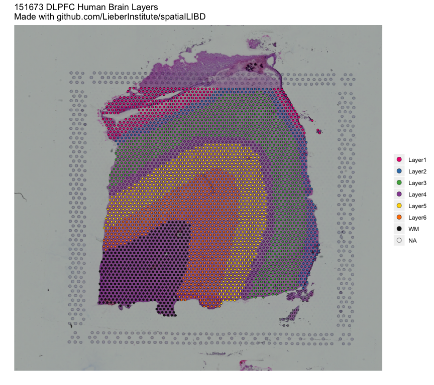

<!-- README.md is generated from README.Rmd. Please edit that file -->

# spatialLIBD 

<!-- badges: start -->

[](https://www.tidyverse.org/lifecycle/#maturing)
[](https://travis-ci.org/LieberInstitute/spatialLIBD)
[](https://bioconductor.org/checkResults/release/bioc-LATEST/spatialLIBD)
[](https://codecov.io/gh/LieberInstitute/spatialLIBD?token=GcSS9zWSp7)
<!-- badges: end -->

The `spatialLIBD` package contains functions for:

  - Accessing the spatial transcriptomics data from the LIBD Human Pilot
    project ([code on
    GitHub](https://github.com/LieberInstitute/HumanPilot)) generated
    with the Visium platform from 10x Genomics. The data is retrieved
    from [Bioconductor](http://bioconductor.org/)’s `ExperimentHub`.
  - Visualizing the spot-level spatial gene expression data and
    clusters.
  - Inspecting the data interactively either on your computer or through
    [jhubiostatistics.shinyapps.io/spatialLIBD/](https://jhubiostatistics.shinyapps.io/spatialLIBD/).

For more details, please check the [documentation
website](http://lieberinstitute.github.io/spatialLIBD) or the
Bioconductor package landing page
[here](https://bioconductor.org/packages/spatialLIBD).

## Installation instructions

Get the latest stable `R` release from
[CRAN](http://cran.r-project.org/). Then install `spatialLIBD` using
from [Bioconductor](http://bioconductor.org/) the following code:

``` r
if (!requireNamespace("BiocManager", quietly = TRUE))
    install.packages("BiocManager")

BiocManager::install("spatialLIBD")
```

## Access the data

Using `spatialLIBD` you can access the Human DLPFC spatial
transcriptomics data from the 10x Genomics Visium platform. For example,
this is the code you can use to access the layer-level data. For more
details, check the help file for `fetch_data()`.

``` r
## Load the package
library('spatialLIBD')

## Download the spot-level data
sce <- fetch_data(type = 'sce')
#> Loading objects:
#>   sce

## This is a SingleCellExperiment object
sce
#> class: SingleCellExperiment 
#> dim: 33538 47681 
#> metadata(1): image
#> assays(2): counts logcounts
#> rownames(33538): ENSG00000243485 ENSG00000237613 ... ENSG00000277475
#>   ENSG00000268674
#> rowData names(9): source type ... gene_search is_top_hvg
#> colnames(47681): AAACAACGAATAGTTC-1 AAACAAGTATCTCCCA-1 ...
#>   TTGTTTCCATACAACT-1 TTGTTTGTGTAAATTC-1
#> colData names(53): barcode sample_name ... expr_chrM expr_chrM_ratio
#> reducedDimNames(6): PCA TSNE_perplexity50 ... TSNE_perplexity80
#>   UMAP_neighbors15
#> spikeNames(0):
#> altExpNames(0):

## Note the memory size
pryr::object_size(sce)
#> 2.08 GB

## Remake the logo image with histology information
sce_image_clus(
    sce = sce,
    clustervar = 'layer_guess_reordered',
    sampleid = '151673',
    colors = libd_layer_colors,
    ... = ' LIBD Layers'
)
```



## Citation

Below is the citation output from using `citation('spatialLIBD')` in R.
Please run this yourself to check for any updates on how to cite
**spatialLIBD**.

``` r
citation('spatialLIBD')
#> 
#> Collado-Torres L, Maynard KR, Jaffe AE (2020). _LIBD Visium spatial
#> transcriptomics human pilot data inspector_. doi:
#> 10.18129/B9.bioc.spatialLIBD (URL:
#> https://doi.org/10.18129/B9.bioc.spatialLIBD),
#> https://github.com/LieberInstitute/spatialLIBD - R package version
#> 0.99.0, <URL: http://www.bioconductor.org/packages/spatialLIBD>.
#> 
#> Maynard KR, Collado-Torres L, Weber LM, Uytingco C, Williams SR, II
#> JLC, Barry BK, Tran MN, Besich Z, Tippani M, Chew J, Yin Y, Hyde TM,
#> Rao N, Hicks SC, Martinowich K, Jaffe AE (2020). "Transcriptome-scale
#> spatial gene expression in the human dorsolateral prefrontal cortex."
#> _bioRxiv_. doi: 10.1101/xxxyyy (URL: https://doi.org/10.1101/xxxyyy),
#> <URL: https://doi.org/10.1101/xxxyyy>.
#> 
#> To see these entries in BibTeX format, use 'print(<citation>,
#> bibtex=TRUE)', 'toBibtex(.)', or set
#> 'options(citation.bibtex.max=999)'.
```

## Code of conduct

Please note that the `spatialLIBD` project is released with a
[Contributor Code of Conduct](CODE_OF_CONDUCT.md). By contributing to
this project, you agree to abide by its terms.

## Development tools

  - Testing on Bioc-devel is possible thanks to [R
    Travis](http://docs.travis-ci.com/user/languages/r/).
  - Code coverage assessment is possible thanks to
    [codecov](https://codecov.io/gh).
  - The [documentation
    website](http://lieberinstitute.github.io/spatialLIBD) is
    automatically updated thanks to
    *[pkgdown](https://CRAN.R-project.org/package=pkgdown)* and
    *[travis](https://github.com/ropenscilabs/travis)*.

<a href="https://www.libd.org/"></a>
